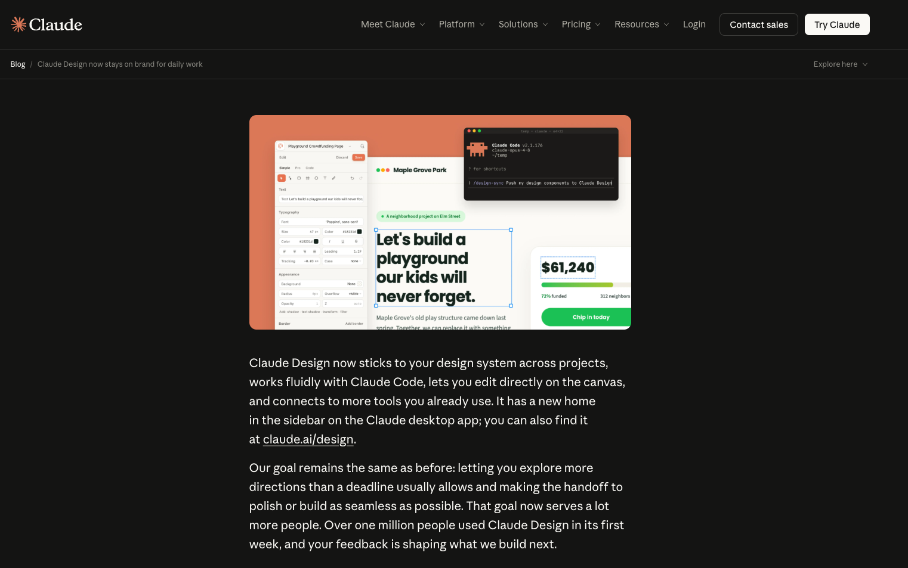
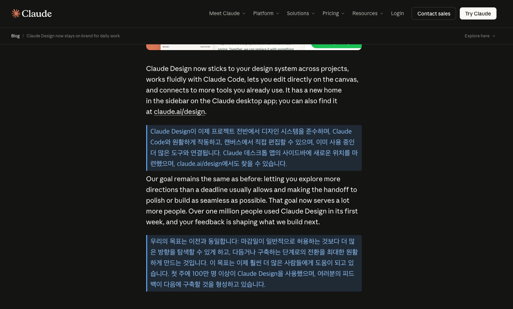

# AI 번역 확장프로그램 (ai-translate-extension)

> An open-source Chrome extension that translates web pages with AWS Bedrock (Claude Sonnet / Amazon Nova) or OpenRouter (GPT / Gemini / Claude, …). MIT licensed.

웹페이지를 AI로 번역하는 **오픈소스** Chrome 확장프로그램입니다. 번역 백엔드로 **AWS Bedrock**(Claude Sonnet / Amazon Nova)과 **OpenRouter**(GPT/Gemini/Claude 등)를 선택할 수 있습니다.

## 미리보기

원본 + 번역 비교 보기 (번역 전 → 후):

| 번역 전 | 번역 후 |
|---|---|
|  |  |

## 기능

1. **드래그 선택 번역** — 텍스트를 드래그하면 뜨는 `번역` 버튼, 또는 우클릭 메뉴 → *선택 영역 번역*
2. **전체 번역** — 페이지 전체를 번역 (원본 대체)
3. **원본 + 번역 비교 보기** — 원문 아래에 번역문을 함께 표시 (다크 테마에서 색 자동 대응)
4. **원본 복원** — 번역 전으로 되돌리기
5. **번역 캐시** — 같은 문장은 캐시에서 재사용 → API 호출·비용 0
6. **새로고침 시 자동 재적용** — 번역한 페이지는 새로고침해도 캐시로 즉시·무료 재번역
7. **모델별 사용량/비용 추적** — 실측 토큰 수 누적, 비용 표시
8. **단축키 / 우클릭 메뉴** 지원

## 동작 구조

```
콘텐츠/팝업 ──메시지──> 백그라운드 서비스 워커 ──> 번역 백엔드(Bedrock / OpenRouter)
```

- 모든 번역 호출은 **백그라운드 서비스 워커**에서 처리합니다. 확장프로그램의 `host_permissions` 덕분에 CORS 제약 없이 직접 호출되며, **자격증명/키는 웹페이지(콘텐츠 스크립트)에 노출되지 않습니다.**
- 키·자격증명은 `chrome.storage.local`에만 저장되고 외부로 전송되지 않습니다. (구글 계정으로 동기화되지 않음)

## 설치

1. `chrome://extensions` → **개발자 모드** ON
2. **압축해제된 확장 프로그램을 로드합니다** → 이 폴더 선택
3. 확장 아이콘 → **설정(옵션)** 에서 백엔드/키 설정 후 저장

> 스크린샷이 포함된 단계별 안내는 **[세팅법 가이드(docs/SETUP.md)](docs/SETUP.md)** 를 참고하세요.

---

## 백엔드 1 — AWS Bedrock (서울 리전)

기본 모델은 **Claude Haiku 4.5**(`global.anthropic.claude-haiku-4-5-20251001-v1:0`, 빠르고 저렴)이며, **Claude Sonnet 4.6**(고품질)과 **Amazon Nova Lite / Micro / Pro**도 옵션에서 고를 수 있습니다. 서울 리전에서 **Claude는 `global.` 추론 프로파일**, **Nova는 `apac.` 추론 프로파일**로 호출됩니다.

세 가지 인증 방식 중 선택:

### A. Bedrock API 키 (가장 간단)
- AWS 콘솔 → Amazon Bedrock → **API keys** → Generate API key
- 발급한 키를 옵션에 입력. (단기 키는 최대 12시간, 장기 키는 만료 지정)

### B. 임시 자격증명 (STS / SigV4)
- `aws sts get-session-token` / `aws configure export-credentials --format env` / SSO 등으로 받은 임시 자격증명(Access Key / Secret Key / Session Token)을 입력
- 확장이 **SigV4 서명**으로 호출. 영구 IAM access key가 아니므로 access key 발급이 막힌 환경에서도 사용 가능. 만료 시 갱신 필요.

### C. AWS SSO 로그인 (IAM Identity Center)
- `aws sso login`과 동일한 **디바이스 인증 플로우**. 옵션에 SSO 시작 URL / 리전 / 계정 ID / Role(권한세트) 입력 후 **SSO 로그인** 클릭 → 새 탭에서 승인 → 임시 자격증명 자동 발급
- 임시 자격증명(~1시간)은 SSO 세션 토큰(~8시간)으로 브라우저 없이 자동 갱신

> Bedrock 사용 시 해당 자격증명/Role에 **`bedrock:InvokeModel`** 권한과 Bedrock **Model access** 활성화가 필요합니다.
>
> **Claude 모델(기본 Haiku 4.5)을 쓸 때 주의 2가지:**
> 1. Bedrock 콘솔 → **Model access**에서 쓰려는 **Anthropic Claude 모델(기본: Claude Haiku 4.5)**을 활성화해야 합니다. (모델마다 따로 켜야 함 → 안 켜면 403)
> 2. Claude 4.6은 **Global 추론 프로파일**이라 호출 시 IAM 조건키 **`aws:RequestedRegion`** 값이 **`"unspecified"`**가 됩니다. IAM 정책을 특정 리전으로 좁혀뒀다면 **`unspecified`도 함께 허용**해야 403(AccessDenied)이 나지 않습니다.

### 모델/리전 참고
- 서울 리전: **Claude**(Haiku 4.5/Sonnet 4.6)는 `global.` 프로파일, **Nova**는 `apac.` 프로파일(예: `apac.amazon.nova-lite-v1:0`) 사용
- 모델 ID·리전이 안 맞으면 400(invalid model identifier) / 404 발생

---

## 백엔드 2 — OpenRouter

OpenAI 호환 API(`chat/completions`)로 여러 LLM을 호출합니다.

1. [openrouter.ai/keys](https://openrouter.ai/keys) 에서 **일반 추론 API 키** 발급
   - ⚠️ **Provisioning/Management 키는 추론에 못 씁니다** (호출 시 `User not found` 401). 일반 API 키를 발급하세요.
2. 옵션 → 번역 백엔드 **OpenRouter** → 키 + 모델 ID(`provider/model`) 입력
   - 추천: `openai/gpt-4o-mini`, `google/gemini-2.0-flash-001`
3. 비용은 응답에서 실제 값을 받아와 사용량 표에 표시됩니다.

---

## 단축키 (기본값, Mac)

| 기능 | 단축키 |
|---|---|
| 전체 번역 (원본 대체) | `⌘⇧Y` |
| 전체 번역 (원문+번역) | `⌘⇧K` |
| 선택 영역 번역 | `⌘⇧U` |

`chrome://extensions/shortcuts`에서 변경할 수 있습니다 (옵션의 "단축키 변경" 버튼).

## 사용량 / 비용

- 설정 페이지에 **모델별 요청 수 / 입력 토큰 / 출력 토큰 / 비용** 표시
- **토큰 수는 항상 실측**(제공자 응답의 usage 값). 캐시로 처리된 건 API 호출이 없어 집계되지 않음(= 실제 과금분만)
- 비용: **OpenRouter는 실제 값**, **Bedrock(Claude/Nova)은 토큰 실측 × 참고 단가 추정**

## 보안 메모

- 키/자격증명은 코드·저장소에 없고 `chrome.storage.local`(로컬 평문)에만 저장됩니다.
- 웹페이지·다른 확장·저장소를 통한 탈취는 차단되어 있고, 현실적 위험은 "이 PC 자체가 털릴 때"뿐입니다.
- 권장: **임시 자격증명/SSO 사용 + IAM 권한 최소화(`bedrock:InvokeModel`만)** 로 노출 시 피해를 최소화하세요.

## 한계

- 전체 번역은 문단 단위(`p`, `h1~h6`, `li`, `td` 등)로 처리하며, 원본 대체 모드에서는 인라인 서식(굵게/링크)이 단순 텍스트로 바뀔 수 있습니다.
- 동적으로 로드되는 콘텐츠는 다시 번역을 실행해야 반영됩니다.
- `chrome://`, 웹스토어, PDF 뷰어 등 일부 페이지에서는 콘텐츠 스크립트가 동작하지 않습니다.

## 기여 (Contributing)

이슈·PR 환영합니다. 빌드 도구·번들러 없이 순수 JS/HTML/CSS로 구성돼 있어, 폴더를 그대로 `chrome://extensions`에 압축해제 로드하면 바로 개발할 수 있습니다.

- `manifest.json` — MV3 설정
- `background.js` — 번역 백엔드 호출(Bedrock SigV4 / API 키 / SSO, OpenRouter), 캐시·사용량
- `content.js` — 페이지 내 UI(선택 번역/전체 번역/비교/복원), 본문 추정
- `options.*` / `popup.*` — 설정 및 팝업

## 라이선스

[MIT](LICENSE) — 자유롭게 사용·수정·배포할 수 있습니다.
