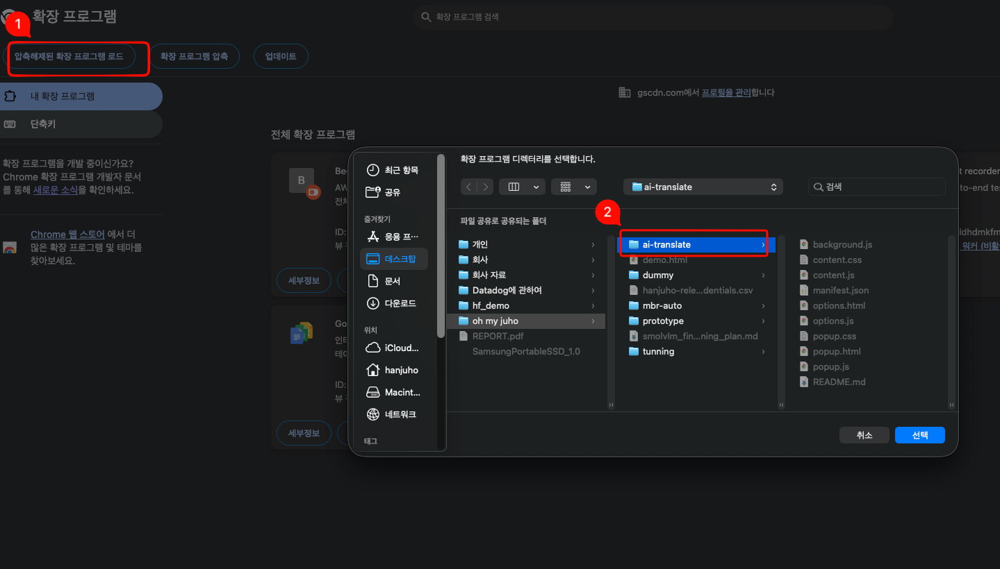
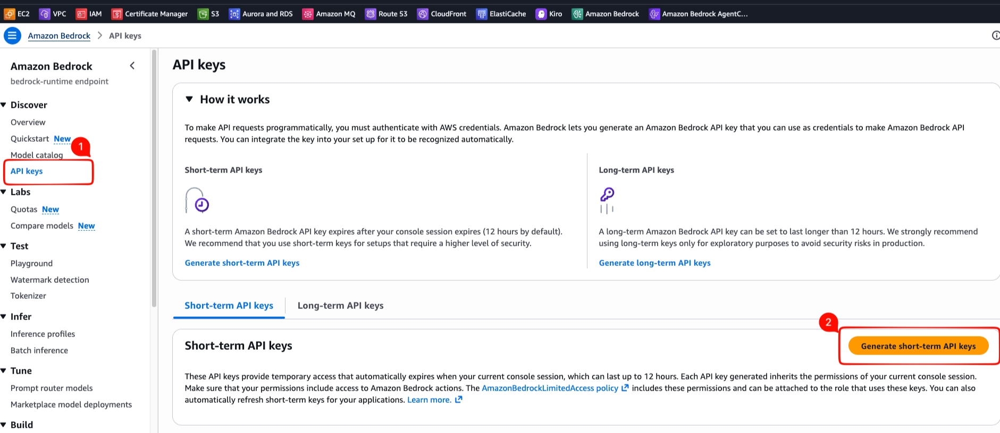
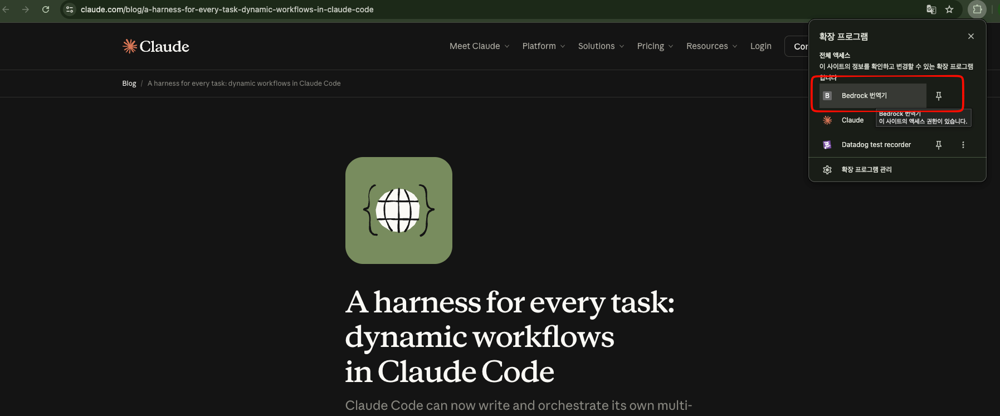
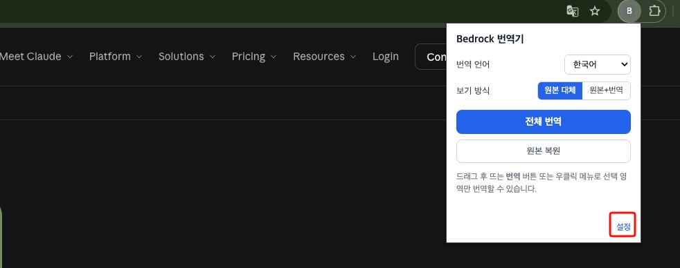
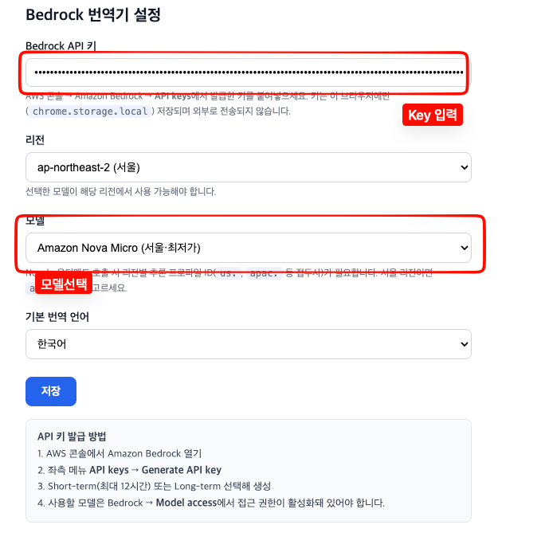
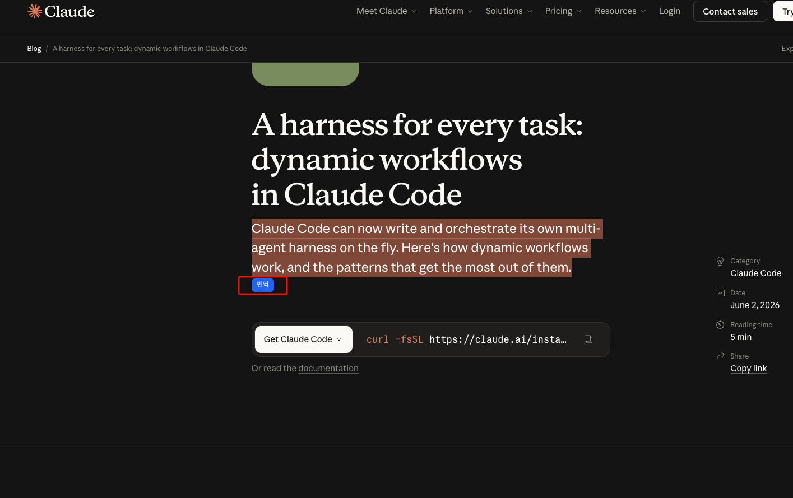
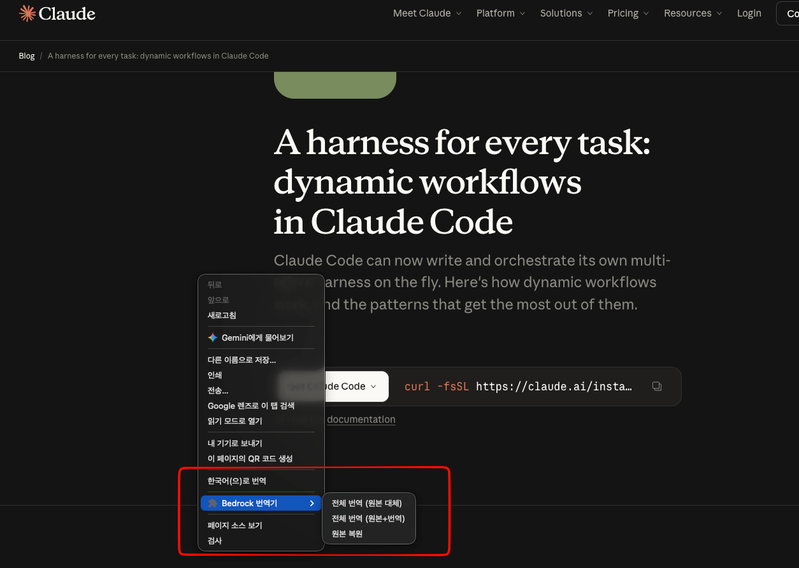

# AI 번역기 세팅법

## 1. `chrome://extensions` 에 접속합니다

1. [chrome://extensions/](chrome://extensions/) 접속 후 **압축해제된 확장 프로그램 로드** 클릭
2. 공유 받은 폴더 선택

> 주의) 크롬 확장은 로컬에서 해당 폴더를 참조하기 때문에 폴더를 삭제하면 안 됩니다.

## 2. Bedrock API Key 발급

Amazon Bedrock → **API Keys** 에서 키 발급

## 3. 발급받은 Key를 삽입

확장프로그램 옵션(설정)에서 발급받은 키를 입력하고 저장합니다.

## 4. 사용법

1. 드래그하여 번역

2. 우클릭하여 번역

